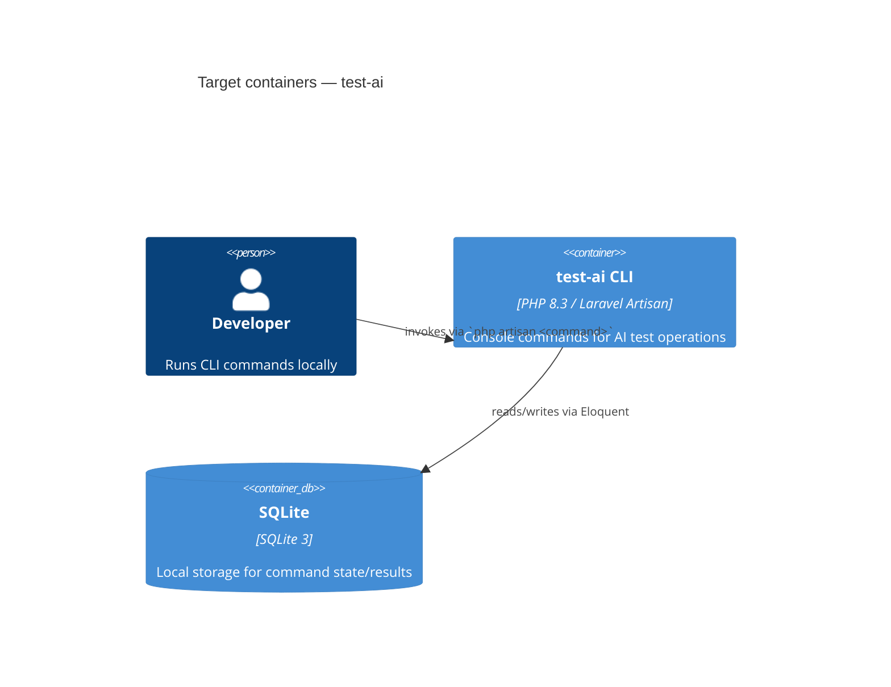

# Architecture map — test-ai

> **Greenfield bootstrap.** No source exists yet — this is the **target foundation** fixed with the
> user, not a scan of existing code. `implement` materializes it via the scaffold `tasks.json` at
> `docs/features/_scaffold/tasks.json`. Once scaffolded, a future `survey` re-run switches this file
> to `mode: current` and cites real files.

## Stack

- Language / runtime: PHP 8.3
- Frameworks: Laravel (11.x) — CLI tool built as Artisan console commands (no HTTP layer)
- Build / test / lint: `composer install` · `php artisan test` (Pest) · `./vendor/bin/pint --test`

## C4 — target baseline

## Module inventory

| Module | Path | Layers | Wired at | Responsibility |
|---|---|---|---|---|
| Console Commands | `app/Console/Commands/` | app | `routes/console.php` (auto-discovered) | CLI entry points |
| Models | `app/Models/` | domain | `database/migrations/` | Eloquent data entities |

## Conventions (target — the rules the scaffold + every feature must match)

- **Module wiring / registration:** commands auto-discovered by Laravel from `app/Console/Commands/`
- **Error handling:** exceptions bubble to Laravel's handler; commands return explicit exit codes (0 success, 1 failure) — `app/Exceptions/Handler.php`
- **IDs:** Eloquent auto-increment integer primary keys (Laravel default — simplest fit for a course-scale CLI tool)
- **Persistence / DB access:** Eloquent ORM over SQLite — `database/database.sqlite`
- **Migrations:** Laravel migrations, timestamped, via `php artisan make:migration` — `database/migrations/`
- **Tests:** Pest — unit tests in `tests/Unit/`, feature tests in `tests/Feature/`
- **Inter-module communication:** direct method calls within the monolith (no message bus needed for a single CLI tool)
- **UI / styling:** N/A — no frontend

## Datastores

| Store | Engine | Accessed via | Notes |
|---|---|---|---|
| SQLite | SQLite 3 | Eloquent ORM | local file `database/database.sqlite`; dev + test storage |

## Frontend / UI foundation

<!-- N/A: no frontend — pure CLI tool -->

## Where things live / closest precedents

- A new CLI command → `app/Console/Commands/`, one class per command (Laravel's default single-responsibility command style).
- A new data entity → `app/Models/` + a paired migration in `database/migrations/`.

## Constraints & known tech-debt

- None yet — this is a fresh scaffold. The first feature's `specify`/`design` pass will record any real constraint as it appears.

## Reconciliation with the authored architecture doc

No authored architecture doc exists; this map is the current (foundation) reference.
