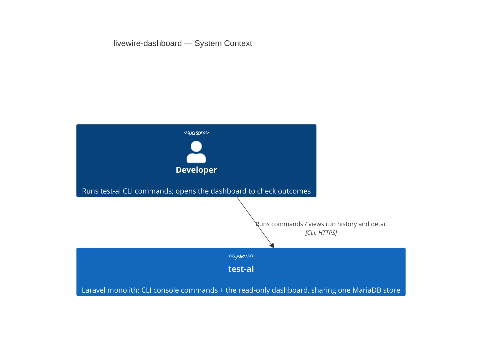
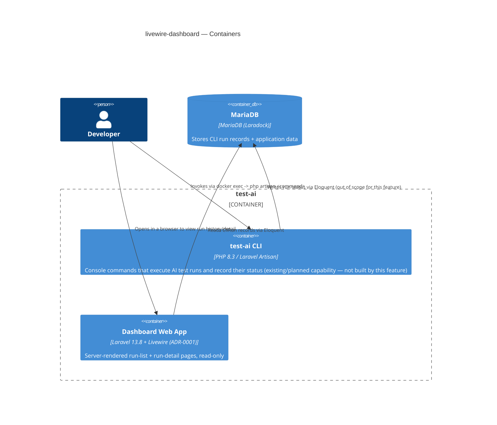
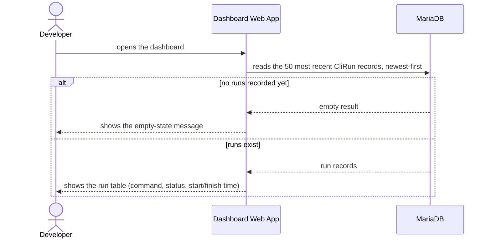
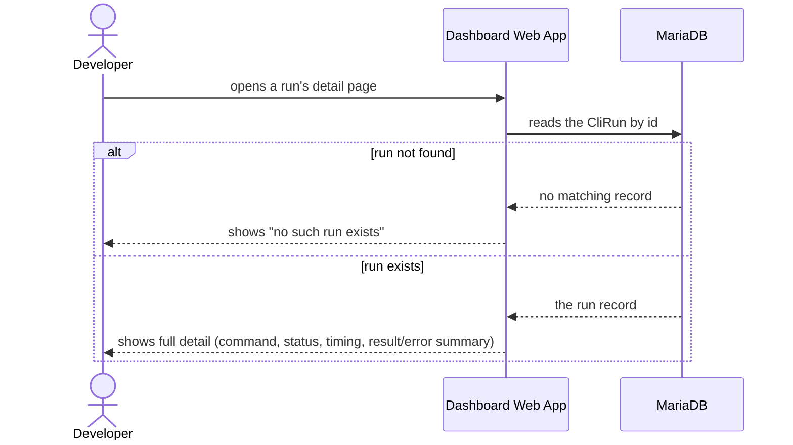

# Software Architecture Document — livewire-dashboard

<!-- 12 Arc42 sections. Empty section → <!-- N/A: <one-line reason> -->. -->
<!-- C4 Context (L1) lives inline in §3. C4 Container (L2) lives inline in §5. -->
<!-- Numbers in §10 come VERBATIM from spec.md §6 NFR — no inventing, no rounding. -->

## 1. Introduction and goals

**Intent.** A read-only web dashboard for the test-ai CLI tool: any developer who runs `test-ai` console commands can check the outcome of a recorded run — its status, timing, and result — without querying the database directly or re-reading raw CLI output. The dashboard becomes the default place a developer looks first to check run status, replacing ad-hoc DB access.

**Top-3 quality goals (1-liners; full scenarios in §10):**

1. Status accuracy — 0% stale-status reads; what the dashboard shows must exactly match the run record's current value at the moment of that load.
2. Read performance — p95 ≤ 500 ms on both the run list and the run detail load.
3. Availability — ≥ 99% successful page loads.

**Stakeholders.**

| Role | Interest | Sign-off owner? |
|---|---|---|
| Developer (CONTEXT.md — runs CLI commands, reviews results, the single actor of this feature) | Checks run status/outcome via the dashboard instead of the DB | No |
| Tech Lead | SAD approval; owns the open questions on deployment reach and future auth (spec §8) | Yes |

<!-- Decision overrides (¶4) — populated by the critic resolution loop, empty otherwise. -->

## 2. Constraints

**Technical.**
- PHP 8.3.
- Laravel ^13.8 (actual, from `composer.json`). **Override note:** `docs/architecture-map.md` currently states Laravel 11.x with "no HTTP layer / no frontend" — that is stale relative to the checked-out code (a full web skeleton — `routes/web.php`, `resources/views/`, `vite.config.js`, Tailwind v4 — is already on disk, just unused). This SAD documents the real stack; the map itself should be reconciled by re-running `survey` (tracked as a §11 risk).
- MariaDB (Laradock, Docker), accessed only via Eloquent ORM from inside the `laradock-php-fpm-1` container.
- Frontend build tooling already scaffolded but unstyled: Vite + `@tailwindcss/vite` v4 (`package.json`). Livewire is **not** yet a composer dependency — adding it is a §4 decision, not assumed here.
- No architecture-layering convention is established yet beyond Laravel defaults (single-responsibility Console Commands, Eloquent Models) — no hexagonal/ports style in the repo to inherit.

**Organisational.**
- Effort budget: not stated in spec; `.size` classifies this feature M (1–2 sprints, new module/migration) — no sharper number given. TBD by PM (see §11).
- Deadline: none stated in spec. TBD by PM (see §11).
- Team: solo developer, course/demo-scale project (per spec §1, §6.1).

**Conventions.**
- `docs/architecture-map.md` §Conventions: Eloquent auto-increment integer PKs; migrations via `php artisan make:migration`; Pest tests in `tests/Unit/` + `tests/Feature/`; lint via `./vendor/bin/pint --test`.
- Error handling: exceptions bubble to Laravel's default handler (`app/Exceptions/Handler.php`); no custom error-mapping layer exists yet.

**Regulatory / external.**
- N/A — internal course/demo data only, no PII, no compliance controls apply (spec §6.1).

## 3. Context and scope

test-ai is a single Laravel monolith with two internal capabilities: console commands that execute AI test runs, and (new in this feature) a read-only web dashboard that lets a developer review those runs. Both capabilities share one MariaDB store. There is no third-party integration — no identity provider, no notification service, no external API — by explicit spec decision (§3, §6.1): the dashboard is open to any developer who can reach the app, no login.

<!-- brownfield: repo scan (2026-08-08) — fresh Laravel 13.8 skeleton (composer.json), no CLI commands or CLI-run model built yet (app/Console/Commands/ empty, only the default User model); a web skeleton (routes/web.php, resources/views/welcome.blade.php, Vite+Tailwind) exists but is unused. This feature is effectively greenfield for the web surface. -->

**External systems (in / out):**

| Actor or system | Type | Interaction |
|---|---|---|
| Developer (CONTEXT.md — single actor, no distinct roles) | Person | Runs `test-ai` CLI commands; opens the dashboard in a browser to check run status/results |
| *(none)* | — | Deliberate: no third-party system in v1 — no auth provider, no notifier, no external API (spec §3, §6.1) |

**C4 Context (L1):**



## 4. Solution strategy

**Top strategic choices (the seeds for ADRs):**

1. **Target surface: `web-frontend` only** — the dashboard is one server-rendered container reading MariaDB directly through Eloquent; no separate backend-API container, since nothing else consumes a JSON contract (spec §3 rules out third-party integration, and non-goals forbid write/trigger actions from the UI). Single surface → the surface-count gate does not fire (fires only on >1 surface); no ADR. `target_surfaces: [web-frontend]` is written to this file's frontmatter.
2. **UI architecture: Livewire full-page components, Filament-inspired but hand-rolled** — resolves the spec §8 open question directly. See **ADR-0001** (`adr/0001-livewire-full-page-components-for-dashboard.md`).
3. **Direct Eloquent access, no service/repository layer** — `RunList`/`RunDetail` query the `CliRun` model directly (via named query scopes for the shared "50 most recent, newest-first" logic AC-01 and AC-05 both need). Reversible, single-module — no ADR; the repo has no existing service-layer convention to match (sad.md §2), and a course-scale, two-query feature does not earn one yet (YAGNI).
4. **No caching layer** — every status read reflects the `CliRun` record directly at request time. This is not a new choice; it is spec §8's own resolution of "can status be cached — no, until revisited" carried forward verbatim, and it is what makes the §1 "0% stale-status reads" quality goal true by construction. No ADR — inherited from the spec, not decided here.
5. **No new inter-module coupling** — the dashboard only *reads* records; it does not call, queue, or send anything to the console-command side of the app (non-goal: no trigger/retry/cancel from the UI). Concurrency is a non-issue for the same reason: no writes originate from this feature.

Each tactical decision in later sections should trace to one of these seeds. Tactical decisions that *contradict* a strategic choice are red flags — surface them in §11.

## 5. Building block view

Flat Laravel-convention layout — no domain/app/infra layering exists anywhere in the repo yet, and a two-page read-only feature doesn't earn introducing one first. The dashboard adds one new folder (`app/Livewire/Dashboard/`) alongside the existing `app/Models/` and `app/Console/Commands/`, following the repo's one-class-per-responsibility style (ADR-0001).

**Internal decomposition:**

```
app/Livewire/Dashboard/
├── RunList.php     <full-page component — the run-history table, AC-01/AC-06>
└── RunDetail.php    <full-page component — one run's detail, AC-02/AC-07>
app/Models/
└── CliRun.php        <the CLI-run entity — fields/migration are data-model's job>
resources/views/livewire/dashboard/
├── run-list.blade.php
└── run-detail.blade.php
routes/web.php         <dashboard.index, dashboard.show — Livewire components as direct route targets>
```

**C4 Container (L2):**



## 6. Runtime view

**Critical flow 1: view run list (AC-01, AC-06)**



**Critical flow 2: view run detail (AC-02, AC-07)**



<!-- AC-03 (no-login), AC-04 (always exactly one status), AC-05 (exact cross-context reflection) are cross-cutting invariants, not flows — covered by §8 crosscutting + §10 quality scenarios. The `sequences` stage completes full §5-AC coverage. -->

## 7. Deployment view

This resolves spec §8's open question ("where does this dashboard actually run and who can reach it?", due at this stage). The dashboard runs inside the same `laradock-php-fpm-1` Docker container as the rest of the app, served via `php artisan serve` (or the dev server) bound to the developer's own machine — no port is published to a LAN or shared network, one process, no replicas, no separate deployment unit. Because reach stays local-only, spec §3's "no login" non-goal keeps its safety assumption intact ("any developer with network access is treated as trusted" only holds because that network is one developer's own machine).

**Monitoring:**
- Metrics: none beyond Laravel's defaults — course/demo scale doesn't warrant a metrics pipeline.
- Alerts: none — no on-call, single local process.
- Tracing: none — Laravel's default log channel (`storage/logs`) is sufficient at this scale.

**Scaling thresholds:**
- N/A — single developer, single process, no concurrent load beyond spec §6's ≥5 req/s target. -->

## 8. Crosscutting concepts

<!-- 🎯 Why: CROSS-CUTTING PATTERNS spanning several modules: logging, errors, authorization, ID
     strategy, events, caching. ⭐ The second-densest section. A pattern inside one module is NOT
     here; a project-wide convention belongs in the convention file.
     📋 Write: a table — concept / convention / where defined. One row per concept.
     📌 e.g. «sortable time-based IDs generated in the app layer» as a default from the convention file. -->

| Concept | Convention | Where defined |
|---|---|---|
| Logging | Laravel's default single log channel, no dashboard-specific fields | `docs/architecture-map.md` §Conventions |
| Authentication | None — no login, no permission checks (deliberate) | spec §3, §6.1 |
| Error handling | Laravel's default exception handler for real errors; "run not found" (AC-02) is an expected Livewire-level branch (`abort(404)` / an in-component not-found state), not a caught exception | here + spec §5 AC-02 |
| ID strategy | Eloquent auto-increment integer PK | `docs/architecture-map.md` §Conventions |
| Internationalisation | N/A — single language (English UI text) | — |
| Observability | N/A at this scale — see §7 monitoring | — |
| Events | N/A — the dashboard only reads, it emits nothing | — |

## 9. Architecture decisions

<!-- 🎯 Why: the REVERSE INDEX onto the adr/ folder. `ls adr/` gives the files; §9 gives the
     semantics — why they exist, which SAD section they attach to, what status.
     📋 Write: a 4-column table, one row per ADR. Mixed status is fine.
     📌 e.g. «0001 | Store content as a table of typed blocks | Accepted | §4». -->

| # | Title | Status | Section |
|---|---|---|---|
| 0001 | Use Livewire full-page components for the dashboard | Accepted | §4 |

ADR files live under `docs/features/<slug>/adr/NNNN-<title>.md`.

## 10. Quality requirements

<!-- 🎯 Why: the QUALITY TREE — take a goal from §1 and break it into concrete leaves: tests,
     metrics, configs, drills. ⭐ Without §10, §1 is a manifesto. With §10 each declaration maps
     to something PROVABLE.
     📋 Write: per §1 goal — When / Then / How-verify. Numbers from spec §6 NFR VERBATIM (don't
     round ≤250ms to ≤300ms — that's a critic F6 hit).
     📌 e.g. «p95 ≤ 500 ms on a block update, verified by a 100 req/s load test». -->

Each top-3 goal from §1 expanded into a full scenario:

**QG-1. Status accuracy**
- **When:** a developer views the dashboard list or a run's detail.
- **Then:** the displayed status/result exactly matches the `CliRun` record's current value — 0% stale-status reads (spec §6 NFR).
- **How verify:** displayed status compared against the record's current value at the moment of that same load (spec §6's own measurement).

**QG-2. Read performance**
- **When:** a developer opens the dashboard list, or a run's detail page.
- **Then:** p95 latency ≤ 500 ms for both the list load and the detail load (spec §6 NFR).
- **How verify:** manual timing / CI smoke test, run at ≥ 5 req/s per instance (spec §6's throughput NFR, folded in here rather than a separate scenario).

**QG-3. Availability**
- **When:** any dashboard or detail page load occurs.
- **Then:** ≥ 99% of loads succeed (spec §6 NFR).
- **How verify:** % of successful dashboard/detail loads over total loads, tracked in application logs (spec §6's own measurement).

## 11. Risks and technical debt

<!-- 🎯 Why: ⭐ collects EVERYTHING that can break — not only the technical. Without §11 risks get
     discussed at standups and lost; debt lives only in the head of whoever accepted it.
     📋 Write: a risk/debt table — severity — mitigation — owner. Accepted debt in its own block.
     📌 The first risk is often a product risk, not a technical one. That's normal. -->

<!-- Severity literals: Low / Medium / High for regular risks; "Open question" for rows created by
     a Save-as-OQ resolution during the Socratic walk (see references/socratic.md). -->

| Risk / debt | Severity | Mitigation | Owner |
|---|---|---|---|
| `docs/architecture-map.md` is stale — it still says "no HTTP layer / no frontend" while a full web skeleton is on disk (§2) | Medium | Re-run `survey` to reconcile the map with the real repo state, ideally before or alongside this feature's `tasks`/`implement` | Architect |
| No deadline or effort budget was stated in spec.md (§2) | Low | PM confirms sprint allocation before `sdd:tasks` runs | PM |
| The CLI side that actually *writes* `CliRun` records (console commands + the recording mechanism) is not built yet in this repo — the dashboard will show only the empty state (AC-06) until it exists | Medium | Sequence delivery so the CLI-run recording capability lands before or alongside this feature, so AC-01/AC-05/AC-07 are demoable | Tech Lead |
| Open architectural decision: mechanism to detect/reclaim a CLI run stuck showing `running` after its process died | Open question | Resolve before `sdd:data-model livewire-dashboard`; default until then — the dashboard faithfully shows the last recorded value even if stale (spec §8) | Tech Lead |
| Open architectural decision: should the dashboard support triggering new CLI runs from the UI | Open question | Resolve before a follow-up feature is proposed; default until then — view-only (spec §3, §8) | PM |
| Open architectural decision: add login/access control once this leaves the course/demo context | Open question | Resolve before any production-facing deployment; default until then — no auth, local-only reach per §7 (spec §6.1, §8) | Tech Lead |

**Accepted debt (acceptable in v1, plan to fix later):**
- No caching layer — every status read reflects the `CliRun` record directly (§4, spec §8). Deliberate: it's what makes the §1 "0% stale-status reads" quality goal true by construction; revisit only if read load ever outgrows a direct DB read.

## 12. Glossary

<!-- 🎯 Why: ⭐ the DOMAIN GLOSSARY that ends arguments a year later («checkpoint — weekly or
     biweekly? quarter — calendar or fiscal?»).
     📋 Write: a term / meaning table. Business + technical terms mixed.
     📌 e.g. «Lesson | a unit inside a course made of blocks (text, video)». -->

| Term | Meaning |
|---|---|
| CLI run | One execution of a `test-ai` CLI command, with a fixed status and timing, that the dashboard visualizes. Not the AI test/scenario the command runs — that's a different concept (CONTEXT.md). |
| Developer | The person who runs `test-ai` CLI commands and reviews their results, including through the dashboard. The single actor of this feature — no distinct permission roles (CONTEXT.md). |
| `CliRun` | The Eloquent model / entity backing a CLI run record (schema fixed at the `data-model` stage, not here). |
| Stale-status read | A dashboard read that does not match the record's current DB value at the moment of that same load — the invariant §1/§10 fix at exactly 0%. |
| Empty state | The dashboard's message shown when no CLI runs have been recorded yet, instead of a blank or broken table (AC-06). |

<!-- Domain glossary terms are CONTEXT.md-canonical (roles: Developer; entities: CLI run). "CliRun", "Stale-status read", "Empty state" are design-introduced technical/UI terms surfaced during this walk — flagging for a possible `glossary` follow-up if reused by other features. -->
